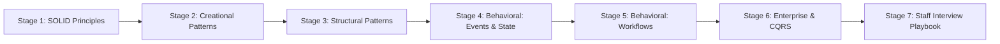
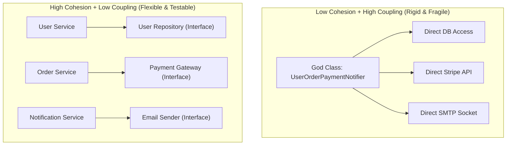
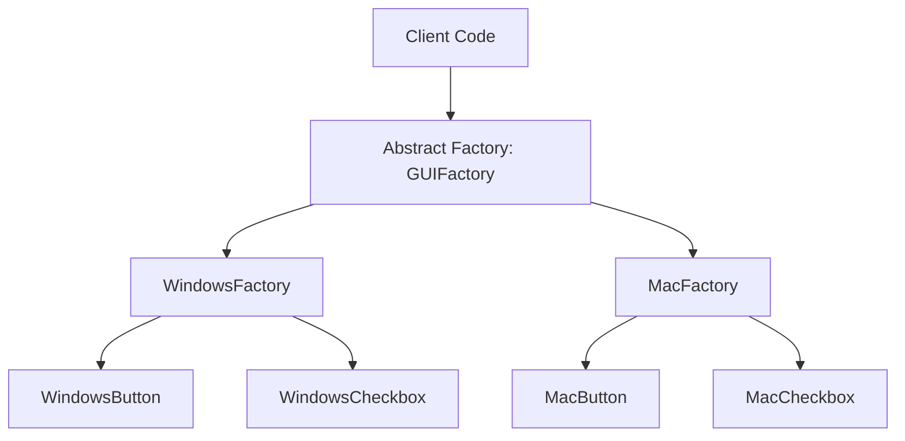
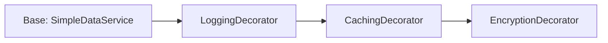
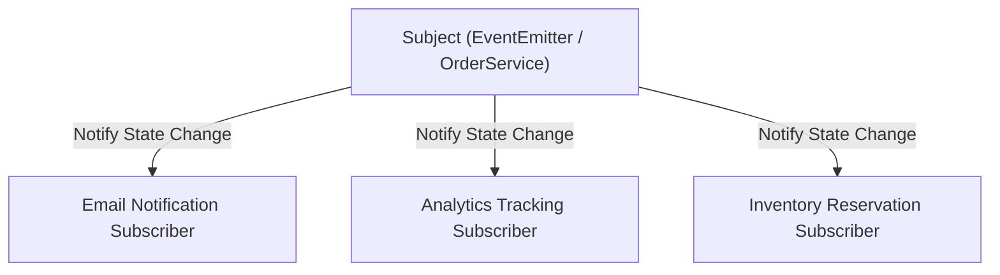
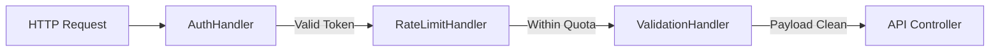
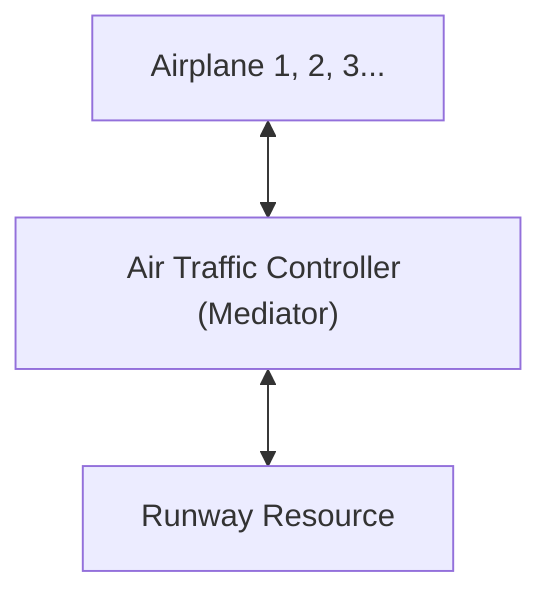
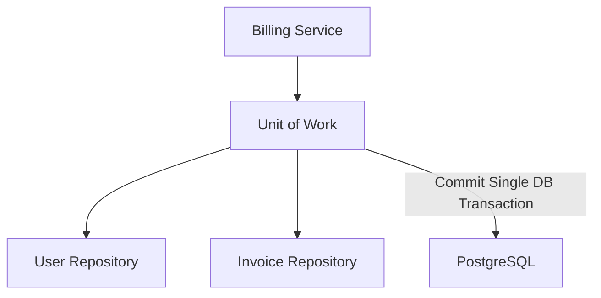
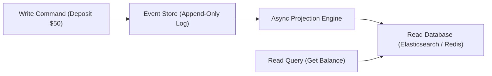
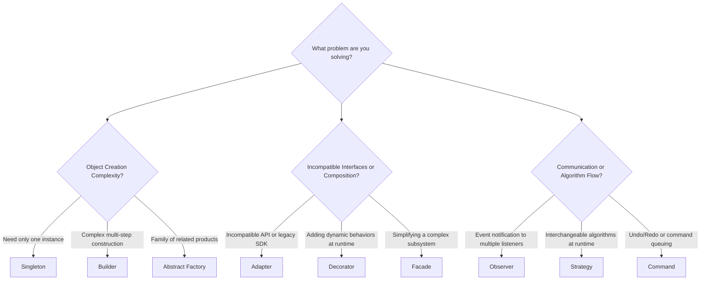

# Learn Design Patterns 🏛️

<div align="center">

[](https://opensource.org/licenses/MIT)
[](https://github.com/manthanank/learn-design-patterns)
[](https://nodejs.org/)
[](https://github.com/manthanank/learn-design-patterns)

**An exhaustive, production-grade masterclass from absolute zero to staff-level software craftsmanship & clean architecture.**  
Master the SOLID principles, all 23 Gang of Four (GoF) creational, structural, and behavioral patterns, modern TypeScript implementations, enterprise architectural paradigms (Repository, Unit of Work, CQRS, Event Sourcing), and anti-pattern refactoring.

[Getting Started](#1-stage-1-object-oriented-foundations--the-solid-principles) • [Creational Patterns](#2-stage-2-creational-design-patterns) • [Structural Patterns](#3-stage-3-structural-design-patterns) • [Behavioral 1](#4-stage-4-behavioral-patterns--events-state--strategy) • [Behavioral 2](#5-stage-5-behavioral-patterns--workflow--traversal) • [Enterprise Architecture](#6-stage-6-enterprise-architectural-patterns) • [Staff Interview Handbook](#7-stage-7-staff-software-engineer-interview-handbook)

<br/>

<a href="https://www.buymeacoffee.com/manthanank">
  
</a>

</div>

---

## 🗺️ 7-Stage Pedagogical Roadmap



| Stage | Focus Domain | Core Concepts & Engineering Outcomes |
| :--- | :--- | :--- |
| **Stage 1** | **OOP Foundations & SOLID** | Single Responsibility, Open/Closed, Liskov Substitution, Interface Segregation, Dependency Inversion, Composition over Inheritance. |
| **Stage 2** | **Creational Patterns** | Singleton (Thread-Safe), Factory Method, Abstract Factory, Builder (Fluent interface), Prototype (Deep Cloning). |
| **Stage 3** | **Structural Patterns** | Adapter (Interface translation), Decorator, Facade, Proxy (Virtual, Protection, Caching), Composite (Tree hierarchies), Flyweight. |
| **Stage 4** | **Behavioral: Events & State** | Observer / Pub-Sub, Strategy (Interchangeable algorithms), Command (Undo/Redo stacks), State Machine pattern. |
| **Stage 5** | **Behavioral: Workflows** | Chain of Responsibility (Middleware pipelines), Mediator, Template Method, Iterator, Visitor (Double Dispatch), Memento. |
| **Stage 6** | **Enterprise Architecture** | Repository & Unit of Work, CQRS & Event Sourcing, Dependency Injection Container, Outbox Pattern, BFF (Backend For Frontend). |
| **Stage 7** | **Staff Engineer Interview Playbook**| Pattern Selection Decision Trees, 6 Anti-Patterns & Refactoring, 25 Staff Interview Q&As, Pattern Matrix Cheat Sheet. |

---

## 📋 Comprehensive Table of Contents

1. [Stage 1: Object-Oriented Foundations & The SOLID Principles](#1-stage-1-object-oriented-foundations--the-solid-principles)
   - 1.1 [Coupling vs Cohesion: The Twin Metrics of Software Quality](#11-coupling-vs-cohesion-the-twin-metrics-of-software-quality)
   - 1.2 [Composition Over Inheritance](#12-composition-over-inheritance)
   - 1.3 [The SOLID Principles Deep Dive](#13-the-solid-principles-deep-dive)
   - 1.4 [Line-by-Line Breakdown: Refactoring Violations to SOLID](#14-line-by-line-breakdown-refactoring-violations-to-solid)
2. [Stage 2: Creational Design Patterns](#2-stage-2-creational-design-patterns)
   - 2.1 [Singleton Pattern (Thread-Safe & Testing Considerations)](#21-singleton-pattern)
   - 2.2 [Factory Method vs Abstract Factory](#22-factory-method-vs-abstract-factory)
   - 2.3 [Builder Pattern (Fluent Construction & Director)](#23-builder-pattern-fluent-construction--director)
   - 2.4 [Prototype Pattern (Deep Cloning Mechanics)](#24-prototype-pattern-deep-cloning-mechanics)
3. [Stage 3: Structural Design Patterns](#3-stage-3-structural-design-patterns)
   - 3.1 [Adapter Pattern (Object vs Class Adapter)](#31-adapter-pattern-object-vs-class-adapter)
   - 3.2 [Decorator Pattern (Dynamic Behavior Layering)](#32-decorator-pattern-dynamic-behavior-layering)
   - 3.3 [Facade Pattern (Subsystem Simplification)](#33-facade-pattern-subsystem-simplification)
   - 3.4 [Proxy Pattern (Virtual, Protection, and Caching)](#34-proxy-pattern-virtual-protection-and-caching)
   - 3.5 [Composite & Flyweight Patterns](#35-composite--flyweight-patterns)
4. [Stage 4: Behavioral Patterns - Events, State & Strategy](#4-stage-4-behavioral-patterns--events-state--strategy)
   - 4.1 [Observer Pattern & Event-Driven Decoupling](#41-observer-pattern--event-driven-decoupling)
   - 4.2 [Strategy Pattern (Runtime Algorithm Interchangeability)](#42-strategy-pattern-runtime-algorithm-interchangeability)
   - 4.3 [Command Pattern (Undo, Redo, and Task Queuing)](#43-command-pattern-undo-redo-and-task-queuing)
   - 4.4 [State Pattern (Finite State Machines without Conditional Spaghetti)](#44-state-pattern-finite-state-machines-without-conditional-spaghetti)
5. [Stage 5: Behavioral Patterns - Workflow & Traversal](#5-stage-5-behavioral-patterns--workflow--traversal)
   - 5.1 [Chain of Responsibility (Express/Koa Middleware Pipeline)](#51-chain-of-responsibility-expresskoa-middleware-pipeline)
   - 5.2 [Mediator Pattern (Decoupling Complex Many-to-Many Interactions)](#52-mediator-pattern-decoupling-complex-many-to-many-interactions)
   - 5.3 [Template Method vs Strategy](#53-template-method-vs-strategy)
   - 5.4 [Visitor Pattern & Double Dispatch](#54-visitor-pattern--double-dispatch)
   - 5.5 [Memento Pattern (State Rollbacks & Snapshots)](#55-memento-pattern-state-rollbacks--snapshots)
6. [Stage 6: Enterprise Architectural Patterns](#6-stage-6-enterprise-architectural-patterns)
   - 6.1 [Repository Pattern & Unit of Work](#61-repository-pattern--unit-of-work)
   - 6.2 [CQRS (Command Query Responsibility Segregation) & Event Sourcing](#62-cqrs-command-query-responsibility-segregation--event-sourcing)
   - 6.3 [Dependency Injection (IoC Container Architecture)](#63-dependency-injection-ioc-container-architecture)
   - 6.4 [Microservice Patterns: Strangler Fig, Outbox, and BFF](#64-microservice-patterns-strangler-fig-outbox-and-bff)
7. [Stage 7: Staff Software Engineer Interview Handbook](#7-stage-7-staff-software-engineer-interview-handbook)
   - 7.1 [Pattern Selection Decision Framework](#71-pattern-selection-decision-framework)
   - 7.2 [The 6 Fatal Anti-Patterns & How to Refactor Them](#72-the-6-fatal-anti-patterns--how-to-refactor-them)
   - 7.3 [25 Staff-Level Software Craftsmanship Interview Q&As](#73-25-staff-level-software-craftsmanship-interview-qas)
   - 7.4 [The Master GoF & Enterprise Patterns Cheat Sheet](#74-the-master-gof--enterprise-patterns-cheat-sheet)


---

## 1. Stage 1: Object-Oriented Foundations & The SOLID Principles

### 1.1 Coupling vs Cohesion: The Twin Metrics of Software Quality
Every architectural decision in software engineering boils down to balancing two fundamental forces:



- **Cohesion**: How focused and single-purposed a module or class is. High cohesion means elements belong together and collaborate on a unified responsibility.
- **Coupling**: The degree of direct dependency between separate modules. Low coupling means changes to Class A do not break or force modifications in Class B.

---

### 1.2 Composition Over Inheritance
Inheritance (`extends`) creates the strongest possible coupling in object-oriented programming:
- **Fragile Base Class Problem**: Changing a single method in a parent class can inadvertently corrupt the invariants of dozens of child subclasses.
- **Inflexible Taxonomies**: A `Duck` inheriting from `Bird` and `Flyer` cannot adapt if you introduce a `ToyRubberDuck` (does not fly) or an `Airplane` (flies, but is not a bird).
- **The Solution**: **Favor Composition over Inheritance**. Instead of asking *"What IS this object?"*, ask *"What BEHAVIORS DOES IT HAVE?"*. Compose classes using interfaces injected via constructors.

---

### 1.3 The SOLID Principles Deep Dive
Coined by Robert C. Martin ("Uncle Bob"), the 5 SOLID principles establish the foundation of maintainable code:

| Letter | Acronym | Core Mandate | Architectural Benefit |
| :---: | :--- | :--- | :--- |
| **S** | **Single Responsibility Principle (SRP)** | A class should have one, and only one, reason to change. | Isolates bug fixes; prevents merge collisions across teams. |
| **O** | **Open/Closed Principle (OCP)** | Software entities should be open for extension, but closed for modification. | Add new features by writing new classes, not editing existing battle-tested code. |
| **L** | **Liskov Substitution Principle (LSP)** | Subtypes must be substitutable for their base types without altering correctness. | Eliminates unexpected runtime exceptions and defensive `instanceof` checks. |
| **I** | **Interface Segregation Principle (ISP)** | Clients should not be forced to depend on methods they do not use. | Lean, focused interfaces prevent bloated implementations. |
| **D** | **Dependency Inversion Principle (DIP)** | High-level modules should not depend on low-level modules; both should depend on abstractions. | Decouples business logic from external frameworks, databases, and third-party APIs. |

---

### 1.4 Line-by-Line Breakdown: Refactoring Violations to SOLID

```typescript
// VIOLATION: God class violating SRP, OCP, and DIP
class BadOrderProcessor {
  process(order: any) {
    // 1. Calculates tax (Violates SRP)
    const tax = order.amount * 0.1;
    // 2. Charges card with hardcoded Stripe dependency (Violates DIP)
    const stripe = new StripeClient("secret_key");
    stripe.charge(order.amount + tax);
    // 3. Sends raw SMTP email (Violates SRP)
    sendEmail(order.userEmail, "Your order is confirmed!");
  }
}

// CLEAN ARCHITECTURE: SOLID Compliance with Injected Abstractions
export interface PaymentProcessor {
  charge(amount: number): Promise<boolean>;
}

export interface TaxCalculator {
  calculate(amount: number): number;
}

export interface NotificationService {
  notify(recipient: string, message: string): Promise<void>;
}

export class OrderProcessor {
  constructor(
    private taxCalc: TaxCalculator,
    private payment: PaymentProcessor,
    private notifier: NotificationService
  ) {}

  async processOrder(orderId: string, amount: number, email: string): Promise<void> {
    const tax = this.taxCalc.calculate(amount);
    const total = amount + tax;
    const success = await this.payment.charge(total);
    if (success) {
      await this.notifier.notify(email, `Order ${orderId} confirmed for $${total.toFixed(2)}`);
    }
  }
}
```


---


---

### 1.5 The Law of Demeter (Principle of Least Knowledge)
The Law of Demeter (LoD) states that an object should only talk to its immediate friends and not know about the inner details of its friends' friends.
- **The "Train Wreck" Code Smell**: `order.getCustomer().getAddress().getCity().getZipCode()`
  - Highly brittle. If the customer schema changes how address or city is represented, code throughout the application breaks.
- **The Fix (Tell, Don't Ask)**: `order.getDeliveryZipCode()`
  - The `Order` delegates to `Customer`, which delegates to `Address`. Callers only interact with their immediate dependency!


## 2. Stage 2: Creational Design Patterns

### 2.1 Singleton Pattern
Guarantees a class has strictly one instance throughout the application lifecycle and provides a global access point to it:

```typescript
export class DatabaseConnectionPool {
  private static instance: DatabaseConnectionPool | null = null;
  private isConnected: boolean = false;

  // Private constructor prevents direct 'new DatabaseConnectionPool()' instantiation
  private constructor() {
    this.isConnected = true;
  }

  // Thread-safe Lazy Initialization
  public static getInstance(): DatabaseConnectionPool {
    if (!DatabaseConnectionPool.instance) {
      DatabaseConnectionPool.instance = new DatabaseConnectionPool();
    }
    return DatabaseConnectionPool.instance;
  }

  public query(sql: string): string {
    return `Executing [${sql}] on singleton pool.`;
  }
}
```

---

### 2.2 Factory Method vs Abstract Factory
- **Factory Method**: Defines an interface for creating an object, but lets subclasses decide which class to instantiate (e.g. `Logistics.createTransport() -> Truck | Ship`).
- **Abstract Factory**: Provides an interface for creating families of related or dependent objects without specifying their concrete classes:



---

### 2.3 Builder Pattern (Fluent Construction & Director)
Separates the construction of a complex object from its representation, allowing the same construction process to create various representations:

```typescript
export class HttpRequest {
  constructor(
    public url: string,
    public method: string,
    public headers: Record<string, string>,
    public body?: string,
    public timeoutMs?: number
  ) {}
}

export class HttpRequestBuilder {
  private url: string = '';
  private method: string = 'GET';
  private headers: Record<string, string> = {};
  private body?: string;
  private timeoutMs: number = 5000;

  setUrl(url: string): this {
    this.url = url;
    return this;
  }

  setMethod(method: 'GET' | 'POST' | 'PUT' | 'DELETE'): this {
    this.method = method;
    return this;
  }

  setHeader(key: string, value: string): this {
    this.headers[key] = value;
    return this;
  }

  setBody(body: string): this {
    this.body = body;
    return this;
  }

  build(): HttpRequest {
    if (!this.url) throw new Error("URL is required to build HttpRequest");
    return new HttpRequest(this.url, this.method, this.headers, this.body, this.timeoutMs);
  }
}
```

---

### 2.4 Prototype Pattern
Enables copying existing objects without making your code dependent on their concrete classes (using `clone()`):

```typescript
export interface Cloneable<T> {
  clone(): T;
}

export class UserPermissions implements Cloneable<UserPermissions> {
  constructor(public roles: string[], public metadata: Record<string, any>) {}

  clone(): UserPermissions {
    // Deep clone arrays and nested objects
    return new UserPermissions([...this.roles], JSON.parse(JSON.stringify(this.metadata)));
  }
}
```


---

## 3. Stage 3: Structural Design Patterns

### 3.1 Adapter Pattern (Interface Translation)
Converts the interface of a class into another interface clients expect, allowing incompatible classes to work together:

```typescript
// Legacy third-party payment library
class StripeLegacySDK {
  makePaymentInCents(cents: number, customerToken: string): boolean {
    return true;
  }
}

// Modern enterprise unified interface
export interface UnifiedPaymentGateway {
  pay(dollars: number, customerId: string): Promise<boolean>;
}

// Adapter bridges the gap cleanly
export class StripeAdapter implements UnifiedPaymentGateway {
  constructor(private legacySdk: StripeLegacySDK) {}

  async pay(dollars: number, customerId: string): Promise<boolean> {
    const cents = Math.round(dollars * 100);
    return this.legacySdk.makePaymentInCents(cents, customerId);
  }
}
```

---

### 3.2 Decorator Pattern (Dynamic Behavior Layering)
Attaches additional responsibilities to an object dynamically without subclassing:



```typescript
export interface DataService {
  fetchData(id: string): Promise<string>;
}

export class SimpleDataService implements DataService {
  async fetchData(id: string): Promise<string> {
    return `Raw data for ${id}`;
  }
}

export class CachingDecorator implements DataService {
  private cache: Map<string, string> = new Map();

  constructor(private wrappee: DataService) {}

  async fetchData(id: string): Promise<string> {
    if (this.cache.has(id)) {
      return `[CACHED] ${this.cache.get(id)}`;
    }
    const data = await this.wrappee.fetchData(id);
    this.cache.set(id, data);
    return data;
  }
}
```

---

### 3.3 Proxy Pattern (Virtual, Protection, and Caching)
Provides a surrogate or placeholder for another object to control access to it:

| Proxy Type | Purpose | Production Example |
| :--- | :--- | :--- |
| **Virtual Proxy** | Lazy Loading | Delays loading massive 50MB image until first render. |
| **Protection Proxy** | Access Control | Checks RBAC permissions before delegating to document deletion. |
| **Remote Proxy** | Network Marshalling | Represents a microservice or gRPC client stub residing on a remote host. |
| **Caching Proxy** | Response Memoization | Caches expensive database query results. |


---


---

### 3.6 Production Composite Pattern: Hierarchical Filesystem Engine

```typescript
export interface FileSystemItem {
  getName(): string;
  getSize(): number;
  render(indent: string): void;
}

export class FileItem implements FileSystemItem {
  constructor(private name: string, private size: number) {}

  getName(): string { return this.name; }
  getSize(): number { return this.size; }

  render(indent: string): void {
    console.log(`${indent}📄 ${this.name} (${this.size} KB)`);
  }
}

export class DirectoryItem implements FileSystemItem {
  private children: FileSystemItem[] = [];

  constructor(private name: string) {}

  add(item: FileSystemItem): this {
    this.children.push(item);
    return this;
  }

  getName(): string { return this.name; }

  // Recursively aggregates size of all nested subdirectories and files!
  getSize(): number {
    return this.children.reduce((total, child) => total + child.getSize(), 0);
  }

  render(indent: string): void {
    console.log(`${indent}📁 ${this.name}/ (${this.getSize()} KB total)`);
    for (const child of this.children) {
      child.render(indent + "  ");
    }
  }
}
```

| Component | Role in Composite | Polymorphic Guarantee |
| :--- | :--- | :--- |
| **`FileSystemItem`** | Component Interface | Declares common operations (`getSize`, `render`) for both leaves and composites. |
| **`FileItem`** | Leaf Node | Represents terminal elements that have no children; executes work directly. |
| **`DirectoryItem`** | Composite Node | Holds child items; delegates operations recursively down the tree hierarchy. |


## 4. Stage 4: Behavioral Patterns - Events, State & Strategy

### 4.1 Observer Pattern & Event-Driven Decoupling
Defines a one-to-many dependency between objects so that when one object changes state, all its dependents are notified automatically:



```typescript
export interface Observer<T> {
  update(data: T): void;
}

export class Subject<T> {
  private observers: Observer<T>[] = [];

  attach(observer: Observer<T>): void {
    this.observers.push(observer);
  }

  detach(observer: Observer<T>): void {
    this.observers = this.observers.filter(obs => obs !== observer);
  }

  notify(data: T): void {
    for (const observer of this.observers) {
      observer.update(data);
    }
  }
}
```

---

### 4.2 Strategy Pattern (Pluggable Algorithms)
Defines a family of algorithms, encapsulates each one, and makes them interchangeable at runtime:

```typescript
export interface DiscountStrategy {
  calculate(originalPrice: number): number;
}

export class RegularCustomerDiscount implements DiscountStrategy {
  calculate(price: number): number {
    return price; // 0% discount
  }
}

export class VIPCustomerDiscount implements DiscountStrategy {
  calculate(price: number): number {
    return price * 0.8; // 20% discount
  }
}

export class ShoppingCart {
  constructor(private discountStrategy: DiscountStrategy) {}

  setDiscountStrategy(strategy: DiscountStrategy): void {
    this.discountStrategy = strategy;
  }

  checkout(total: number): number {
    return this.discountStrategy.calculate(total);
  }
}
```

---

### 4.3 Command Pattern (Undo/Redo Stacks)
Encapsulates a request as an object, thereby letting you parameterize clients with different requests, queue or log requests, and support undoable operations:

```typescript
export interface Command {
  execute(): void;
  undo(): void;
}

export class DocumentEditor {
  private content: string = "";

  write(text: string): void {
    this.content += text;
  }

  delete(count: number): string {
    const deleted = this.content.slice(-count);
    this.content = this.content.slice(0, -count);
    return deleted;
  }

  getText(): string {
    return this.content;
  }
}

export class WriteTextCommand implements Command {
  constructor(private editor: DocumentEditor, private text: string) {}

  execute(): void {
    this.editor.write(this.text);
  }

  undo(): void {
    this.editor.delete(this.text.length);
  }
}
```


---


---

### 4.5 Production State Pattern: Document Workflow Engine (TypeScript)

```typescript
export interface DocumentState {
  publish(doc: DocumentWorkflow): void;
  render(doc: DocumentWorkflow): string;
}

export class DocumentWorkflow {
  private state: DocumentState;

  constructor() {
    this.state = new DraftState();
  }

  setState(state: DocumentState): void {
    this.state = state;
  }

  publish(): void {
    this.state.publish(this);
  }

  render(): string {
    return this.state.render(this);
  }
}

export class DraftState implements DocumentState {
  publish(doc: DocumentWorkflow): void {
    console.log("Submitting draft for moderation review...");
    doc.setState(new ModerationState());
  }

  render(doc: DocumentWorkflow): string {
    return "[DRAFT] Watermarked Preview Mode";
  }
}

export class ModerationState implements DocumentState {
  publish(doc: DocumentWorkflow): void {
    console.log("Approved by moderation! Publishing document live...");
    doc.setState(new PublishedState());
  }

  render(doc: DocumentWorkflow): string {
    return "[MODERATION] Pending Editor Approval";
  }
}

export class PublishedState implements DocumentState {
  publish(doc: DocumentWorkflow): void {
    console.log("Document is already published and live.");
  }

  render(doc: DocumentWorkflow): string {
    return "[PUBLIC] Live Production Document";
  }
}
```

| State Class | Allowed Transition | Invariant Enforced |
| :--- | :--- | :--- |
| **`DraftState`** | Advances strictly to `ModerationState`. | Prevents unreviewed drafts from becoming publicly accessible. |
| **`ModerationState`**| Advances to `PublishedState` or reverts to `DraftState`. | Requires editor sign-off. |
| **`PublishedState`** | Terminal live state (or triggers archive). | Read-only public presentation. |


## 5. Stage 5: Behavioral Patterns - Workflow & Traversal

### 5.1 Chain of Responsibility (Middleware Pipelines)
Passes requests along a chain of handlers. Upon receiving a request, each handler decides either to process the request or to pass it to the next handler in the chain:



```typescript
export abstract class AbstractHandler {
  private nextHandler: AbstractHandler | null = null;

  setNext(handler: AbstractHandler): AbstractHandler {
    this.nextHandler = handler;
    return handler;
  }

  handle(request: any): boolean {
    if (this.nextHandler) {
      return this.nextHandler.handle(request);
    }
    return true;
  }
}

export class AuthMiddleware extends AbstractHandler {
  handle(request: any): boolean {
    if (!request.token) {
      return false; // Break chain!
    }
    return super.handle(request);
  }
}
```

---

### 5.2 Mediator Pattern (Decoupling Complex Coordination)
Reduces chaotic dependencies between objects by forcing them to communicate solely through a mediator object (e.g. Air Traffic Controller):




---


---

### 5.6 Visitor Pattern & Double Dispatch: AST Calculator

```typescript
export interface ExpressionVisitor<R> {
  visitNumber(expr: NumberLiteral): R;
  visitBinary(expr: BinaryExpression): R;
}

export interface Expression {
  accept<R>(visitor: ExpressionVisitor<R>): R;
}

export class NumberLiteral implements Expression {
  constructor(public value: number) {}

  accept<R>(visitor: ExpressionVisitor<R>): R {
    return visitor.visitNumber(this); // First dispatch on expression type
  }
}

export class BinaryExpression implements Expression {
  constructor(
    public left: Expression,
    public operator: '+' | '-' | '*',
    public right: Expression
  ) {}

  accept<R>(visitor: ExpressionVisitor<R>): R {
    return visitor.visitBinary(this); // First dispatch on expression type
  }
}

// Visitor 1: Evaluator
export class EvaluatorVisitor implements ExpressionVisitor<number> {
  visitNumber(expr: NumberLiteral): number {
    return expr.value;
  }

  visitBinary(expr: BinaryExpression): number {
    const left = expr.left.accept(this);
    const right = expr.right.accept(this);
    switch (expr.operator) {
      case '+': return left + right;
      case '-': return left - right;
      case '*': return left * right;
    }
  }
}
```

| Visitor Operation | Benefit of Visitor Pattern | Double Dispatch Advantage |
| :--- | :--- | :--- |
| `EvaluatorVisitor` | Evaluates arithmetic tree. | Adding pretty-printers or optimizers requires **zero modifications** to `Expression` classes! |
| `PrettyPrinterVisitor` | Prints formatted string `(2 + (3 * 4))`. | New operations are encapsulated in cohesive visitor classes. |


## 6. Stage 6: Enterprise Architectural Patterns

### 6.1 Repository Pattern & Unit of Work
- **Repository Pattern**: Mediates between the domain logic and data mapping layers using a collection-like interface for accessing domain objects (`find()`, `save()`, `delete()`).
- **Unit of Work**: Maintains a list of business objects affected by a business transaction and coordinates writing out changes and resolving concurrency problems.



---

### 6.2 CQRS & Event Sourcing
- **CQRS (Command Query Responsibility Segregation)**: Separates read and update operations for a data store. Commands (`POST/PUT/DELETE`) write to a normalized relational database; Queries (`GET`) read from denormalized Elasticsearch or Redis read-models.
- **Event Sourcing**: Instead of storing just the current state of an entity, stores an immutable append-only log of every domain event that ever happened (`AccountCreated`, `MoneyDeposited`, `MoneyWithdrawn`). Current state is materialized by replaying events!




---


---

### 6.5 Production Inversion of Control (IoC) Container Implementation

```typescript
type Factory<T> = (container: IoCContainer) => T;

export class IoCContainer {
  private services = new Map<string, { factory: Factory<any>; singleton: boolean; instance?: any }>();

  registerTransient<T>(token: string, factory: Factory<T>): void {
    this.services.set(token, { factory, singleton: false });
  }

  registerSingleton<T>(token: string, factory: Factory<T>): void {
    this.services.set(token, { factory, singleton: true });
  }

  resolve<T>(token: string): T {
    const entry = this.services.get(token);
    if (!entry) {
      throw new Error(`Service token [${token}] is not registered in IoC container.`);
    }

    if (entry.singleton) {
      if (!entry.instance) {
        entry.instance = entry.factory(this);
      }
      return entry.instance;
    }

    return entry.factory(this);
  }
}
```

| Lifetime Mode | Instantiation Behavior | Production Use Case |
| :--- | :--- | :--- |
| **`Transient`** | Creates a new fresh instance on every `resolve()` call. | Request handlers, short-lived database transactions. |
| **`Singleton`** | Instantiates once on first resolution; reuses across app. | Database connection pools, configuration registries, Redis clients. |


## 7. Stage 7: Staff Software Engineer Interview Handbook

### 7.1 Pattern Selection Decision Framework



---

### 7.2 The 6 Fatal Anti-Patterns & How to Refactor Them

| Anti-Pattern | Manifestation in Code | Architectural Damage | Clean Refactoring Solution |
| :--- | :--- | :--- | :--- |
| **God Object** | A single massive class with 3,000+ lines doing DB, validation, UI, and networking. | High coupling, impossible to unit test. | Decompose using **Single Responsibility Principle** and Facade. |
| **Golden Hammer** | Using the same tool/pattern for every problem (e.g. storing everything in MongoDB). | Performance collapse, impedance mismatch. | Use polyglot persistence and evaluate trade-offs. |
| **Poltergeist** | Pointless transient classes created just to invoke a method on another class. | Unnecessary cognitive indirection. | Inline or remove the dummy intermediary. |
| **Spaghetti Code** | Unstructured procedural logic with dozens of nested `if/else` checks. | Extreme regression bugs when changing logic. | Refactor using **State** or **Strategy** patterns. |
| **Hardcoding Singletons**| Direct access to `Database.getInstance()` scattered across all classes. | Zero testability; cannot mock DB in tests. | Replace with **Dependency Injection**. |
| **Circular Dependency**| Class A depends on Class B, which depends on Class A. | Memory leaks, build initialization stalls. | Extract shared interface or introduce a **Mediator**. |

---

### 7.3 25 Staff-Level Software Craftsmanship Interview Q&As

#### Q1: What is the Liskov Substitution Principle (LSP) and how is the Classic Rectangle-Square problem a violation?
**Answer:** LSP states that objects of a superclass should be replaceable with objects of its subclasses without breaking application correctness. In geometry, a Square is a Rectangle. However, if class `Square extends Rectangle`, and setting `width` also sets `height` to maintain equal sides, any client expecting a standard rectangle (`rect.setWidth(5); rect.setHeight(10); assert(rect.getArea() === 50)`) will fail because `setHeight(10)` overwrote width to 10, producing an area of 100. This breaks client invariants and violates LSP. The solution is to have both implement a common `Shape` interface instead of inheriting.

#### Q2: What is the difference between Strategy Pattern and State Pattern?
**Answer:** Structurally, both look identical (they share a context class holding an interface reference). The distinction lies in **intent**:
- In the **Strategy Pattern**, the client explicitly configures the context with a specific algorithm (e.g. choose CreditCard vs PayPal discount strategy); strategies are typically independent and unaware of each other.
- In the **State Pattern**, the context changes its internal state object dynamically in response to events (e.g. `Draft -> Review -> Published`), and concrete state classes know about and trigger transitions to succeeding states.

#### Q3: Why is the Singleton pattern frequently considered an anti-pattern?
**Answer:** 
1. **Hidden Global State**: It conceals dependencies inside methods rather than exposing them through constructor parameters.
2. **Breaks Unit Testing**: Singletons persist state across test runs, causing tests to be non-hermetic and order-dependent unless complex teardown reflection is used.
3. **Violates SRP**: It controls its own lifecycle and creation in addition to its core business logic.
4. **Alternative**: Register dependencies as singletons inside a Dependency Injection (DI) container instead of implementing static singletons.

#### Q4: How does the Decorator pattern differ from Subclassing?
**Answer:** Subclassing adds responsibilities statically at compile time; if you need combinations of 4 features (Logging, Caching, Encryption, Compression), inheritance requires $2^4 = 16$ distinct subclasses (`LoggingCachedEncryptedDataService`). The Decorator pattern adds responsibilities dynamically at runtime by wrapping instances, requiring only 4 decorator classes that can be nested in any arbitrary order.

#### Q5: What is the difference between an Abstract Factory and a Builder?
**Answer:** Abstract Factory specializes in creating whole families of related objects immediately in a single method call (`factory.createButton()`, `factory.createWindow()`). Builder specializes in constructing a single complex, multifaceted object step-by-step (`builder.setCPU().setRAM().setGPU().build()`), often allowing different construction paths.

#### Q6: Explain the Dependency Inversion Principle (DIP) and how it enables Clean / Hexagonal Architecture.
**Answer:** DIP states that high-level policy (core business domain logic) should not depend on low-level details (SQL databases, REST clients, AWS SDKs). Instead, the core domain defines interfaces (ports), and the low-level infrastructure implements them (adapters). This enables swapping PostgreSQL for MongoDB or MockDB in tests without touching a single line of core business rules.

#### Q7: What is the Composite Pattern and what is a classic real-world example?
**Answer:** The Composite Pattern composes objects into tree structures to represent part-whole hierarchies, allowing clients to treat individual objects and compositions of objects uniformly. Classic examples:
1. Graphic UI components: A `Container` holds `Buttons` and child `Panels`, and calling `render()` recursively renders all children.
2. Filesystems: A `Directory` contains `Files` and sub-`Directories`, and calling `getSize()` computes total size uniformly.

#### Q8: How does the Observer pattern differ from the Publisher-Subscriber (Pub-Sub) pattern?
**Answer:** 
- In **Observer**, the Subject maintains a direct reference to its Observers and synchronously invokes their notification callback in the same memory process.
- In **Pub-Sub**, publishers and subscribers never know each other exists; they communicate through a completely separate intermediary **Message Broker** (e.g. Redis Pub/Sub, Kafka, RabbitMQ), enabling asynchronous cross-network distributed messaging.

#### Q9: What is the Visitor Pattern and what problem does Double Dispatch solve?
**Answer:** The Visitor pattern allows adding new operations to existing class hierarchies without modifying their source code. Because most object-oriented languages only support single dispatch (routing methods based on the runtime type of the receiver), Visitor uses **Double Dispatch**: the element accepts the visitor (`element.accept(visitor)`), and immediately calls back the visitor with itself (`visitor.visitElementA(this)`), ensuring both the element type and visitor operation are dynamically bound at runtime.

#### Q10: What is the Flyweight Pattern and how does it optimize memory?
**Answer:** Flyweight minimizes memory usage by sharing common immutable state among multiple objects. It divides object data into:
- **Intrinsic State**: Constant, invariant, and shareable across millions of instances (e.g. 3D mesh model, texture).
- **Extrinsic State**: Unique to each instance and passed in externally during method invocation (e.g. $(x,y,z)$ coordinate in a gaming world).

#### Q11: Explain the Command Pattern and how it powers Event Sourcing.
**Answer:** The Command pattern encapsulates a state mutation as a self-contained object holding the method name, target receiver, and parameter values. In Event Sourcing, every command is validated and converted into an immutable historical event record appended to a log, which can be replayed to reconstruct any historical state.

#### Q12: What is the difference between an Object Adapter and a Class Adapter?
**Answer:** An **Object Adapter** uses composition; it holds an instance of the adaptee class inside its private fields. A **Class Adapter** uses multiple inheritance (where supported, like C++ or Python); it inherits from both the target interface and the adaptee class simultaneously. Object adapters are favored because they adhere to composition over inheritance.

#### Q13: What is the Interface Segregation Principle (ISP) and what code smell indicates its violation?
**Answer:** ISP dictates that clients should not be forced to depend upon interfaces they do not use. The primary code smell indicating an ISP violation is an implementing class writing dummy throwaway stubs: e.g. `throw new UnsupportedOperationException("Method not supported")`. The solution is breaking the fat interface into smaller role interfaces.

#### Q14: How does the Facade Pattern promote loose coupling?
**Answer:** A Facade provides a clean, simplified high-level interface to a complex library, framework, or collection of subsystems. Clients interact exclusively with the facade, shielding them from complex internal initialization, class wiring, and dependency chains.

#### Q15: What is the difference between Template Method and Strategy?
**Answer:** 
- **Template Method**: Uses inheritance. An abstract base class defines the skeleton algorithm in a `final` method, and subclasses override specific hook steps.
- **Strategy**: Uses composition. The algorithm is encapsulated inside an independent strategy class injected into the context.

#### Q16: What is a Memento Pattern and what are its components?
**Answer:** Memento captures and externalizes an object's internal state without violating encapsulation, allowing the object to be restored later. Components:
1. **Originator**: The object whose state is being saved.
2. **Memento**: The immutable state snapshot.
3. **Caretaker**: Manages the history of mementos (undo stack) without inspecting memento contents.

#### Q17: What is the Null Object Pattern?
**Answer:** Instead of returning `null` when an object is not found, the Null Object pattern returns a polymorphic instance that implements the expected interface with neutral, no-op behavior (e.g. `NullLogger` that does nothing). This eliminates defensive `if (obj !== null)` checks throughout the codebase.

#### Q18: What is the Unit of Work pattern in Object-Relational Mapping (ORM)?
**Answer:** Unit of Work tracks all objects modified, inserted, or deleted during a business transaction. At the end of the transaction, it calculates the minimal set of database updates required, batches them efficiently, and executes them inside a single database transaction, eliminating redundant round-trips.

#### Q19: Explain the Outbox Pattern in distributed event-driven systems.
**Answer:** In microservices, writing to a database and publishing a Kafka event cannot be done in a single distributed transaction. The Outbox pattern writes both the entity update and an outbox message into the same local ACID database transaction. A separate relay process (CDC / Debezium) tails the outbox table and reliably publishes messages to the message broker.

#### Q20: What is the Chain of Responsibility pattern and how does it prevent tight coupling?
**Answer:** It decouples the sender of a request from its receivers by giving more than one object a chance to handle the request. Handlers are linked in a chain, and each handler inspects the request and either processes it, modifies it, or delegates it down the chain (e.g. Express.js middleware, filter chains in Spring Security).

#### Q21: What is the Strangler Fig Pattern in legacy application modernization?
**Answer:** Named after the Australian strangler fig vine, this pattern modernizes a monolithic system by gradually replacing specific functionalities with new microservices behind an API gateway facade. Over time, the new microservices completely replace the old monolith until the old codebase can be cleanly decommissioned with zero downtime.

#### Q22: What is the difference between Shallow Copy and Deep Copy in the Prototype Pattern?
**Answer:** 
- **Shallow Copy**: Copies the immediate fields of an object. If a field is a reference to an array or nested object, the copy shares the exact same memory pointer with the original. Modifying the copy mutates the original!
- **Deep Copy**: Recursively duplicates all nested objects and data structures, creating completely independent memory allocations.

#### Q23: How does the Mediator pattern simplify UI form coordination?
**Answer:** In a complex form with multiple interdependent dropdowns, checkboxes, and buttons, having each UI element directly call others results in an $O(N^2)$ spaghetti mesh. A Dialog Mediator centralizes all change events: when Checkbox A changes, it informs the Mediator, which enables Button B and refreshes Dropdown C in one coherent place.

#### Q24: What is Inversion of Control (IoC) and how does it relate to Dependency Injection (DI)?
**Answer:** IoC is the broad design principle where the control flow of a program is inverted: instead of custom code calling libraries, a framework calls custom code (the "Hollywood Principle": *Don't call us, we'll call you*). Dependency Injection is a specific design pattern that implements IoC by passing dependencies into objects rather than having objects construct them internally.

#### Q25: How do you refactor a long method with multiple levels of nested conditionals?
**Answer:** 
1. Apply **Guard Clauses**: Invert conditions and return early to eliminate nested indentation.
2. Apply **Extract Method**: Group cohesive statements into small, descriptive helper functions.
3. Replace Conditional with **Polymorphism / Strategy**: If conditionals switch on an object type, replace with polymorphic subclasses or injected strategies.

---

### 7.4 The Master GoF & Enterprise Patterns Cheat Sheet

| Pattern | Category | Intent & Core Purpose |
| :--- | :--- | :--- |
| **Singleton** | Creational | Single application-wide instance with global access. |
| **Factory Method** | Creational | Creates objects via subclass method override. |
| **Abstract Factory**| Creational | Creates families of related products without concrete classes. |
| **Builder** | Creational | Step-by-step construction of complex objects. |
| **Prototype** | Creational | Clones existing objects in memory. |
| **Adapter** | Structural | Bridges incompatible interfaces. |
| **Decorator** | Structural | Dynamically wraps objects to add behaviors. |
| **Facade** | Structural | Simplified entry point to a complex subsystem. |
| **Proxy** | Structural | Surrogate controlling access, caching, or lazy loading. |
| **Composite** | Structural | Treats tree hierarchies of objects uniformly. |
| **Flyweight** | Structural | Shares intrinsic state to conserve massive RAM. |
| **Observer** | Behavioral | One-to-many event notification to subscribers. |
| **Strategy** | Behavioral | Interchangeable runtime algorithm family. |
| **Command** | Behavioral | Encapsulates request as an undoable object. |
| **State** | Behavioral | State machine changing behavior as state changes. |
| **Chain of Resp.** | Behavioral | Pipeline of handlers passing requests sequentially. |
| **Mediator** | Behavioral | Centralized coordinator decoupling peer objects. |
| **Template Method** | Behavioral | Skeleton algorithm in base class with subclass hooks. |
| **Iterator** | Behavioral | Sequential traversal of collections without exposing internals. |
| **Visitor** | Behavioral | Adds new operations to classes via double dispatch. |
| **Memento** | Behavioral | Captures and restores object state snapshots. |
| **Repository** | Enterprise | Collection-like abstraction isolating domain from database. |
| **Unit of Work** | Enterprise | Coordinates transactional atomic commits across repositories. |
| **CQRS** | Enterprise | Segregates read and write data models. |
| **Event Sourcing** | Enterprise | Stores state changes as an immutable sequence of events. |

---

## 🤝 Community & Contributing
Contributions are welcome! Please review our [CONTRIBUTING.md](CONTRIBUTING.md) and [CODE_OF_CONDUCT.md](CODE_OF_CONDUCT.md) guidelines before opening issues or submitting pull requests.

## 📄 License
This project is open-source software licensed under the [MIT License](LICENSE).
